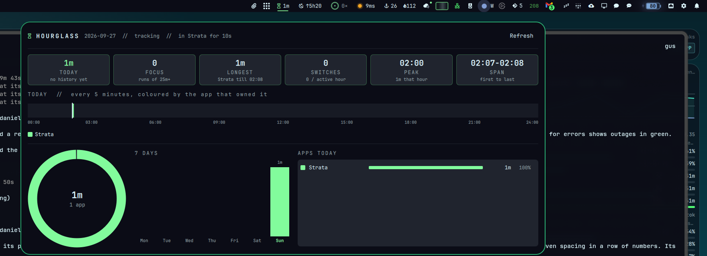
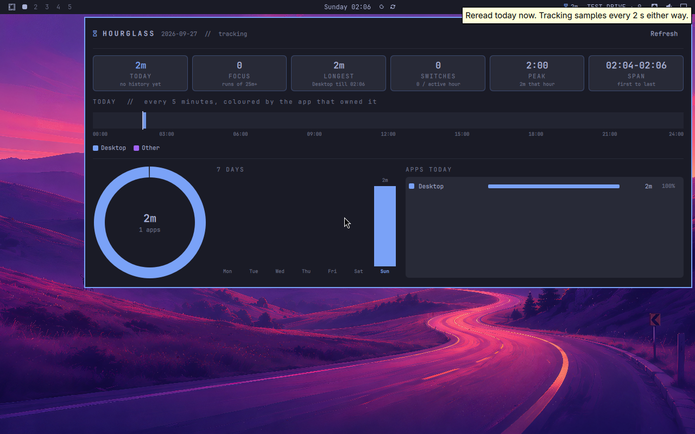

# Hourglass

Screen time for Omarchy. Where did today go?



Hourglass follows which app has focus, sampling every 2 seconds over Hyprland's own socket (no forks, no polling of `hyprctl`). The bar shows today's active time. Click it for the whole day on one screen:

- **Stats:** today vs your 6-day average, focus sessions (unbroken runs of 25 min or more), longest stretch, context switches per active hour, peak hour, first-to-last span.
- **24h ribbon:** 288 five-minute cells, each coloured by the app that owned it. Hover to see which app.
- **Ring:** today's share by app.
- **7 days:** stacked bars in the same app colours.
- **Apps today:** every app with its time and share. The list scrolls inside its own box; the page never scrolls.
- **Stretch nudge:** after 90 unbroken minutes (configurable, 0 turns it off) the hourglass pulses in your theme's urgent colour.

App colours come from your theme accent and walk around the colour wheel, so it looks right on every Omarchy theme.


## What counts as active

The screen is unlocked (no `hyprlock`), and within the last 5 minutes the cursor moved or the focused window or its title changed. Time across a suspend is never counted. Set `HOURGLASS_IDLE_SEC` to change the idle window.

## Privacy

Local only, no network. Only window **classes** are stored (for example `kitty`, `brave-browser`), never titles. Data: `~/.local/share/hourglass/YYYY-MM-DD.json`, one small file per day. Delete them any time.

## Install

```bash
cp -r . ~/.config/omarchy/plugins/nixfred.hourglass
omarchy-shell shell rescanPlugins
omarchy plugin enable nixfred.hourglass
```

The shell service starts `hourglass.py daemon`. It holds a lock, so only one tracker ever runs.

```bash
python3 hourglass.py report    # the JSON the panel reads
```

Tested in Test Drive (Omarchy 4.0.2 plugin checkpoint) first:



MIT licensed.
